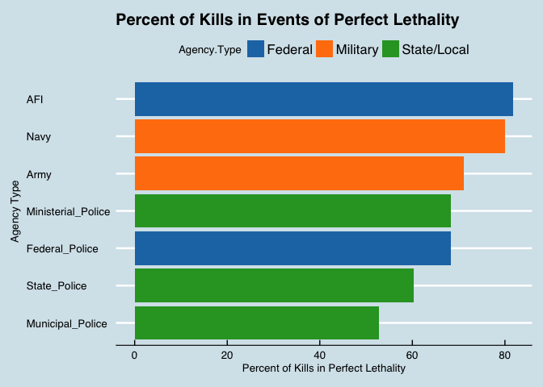
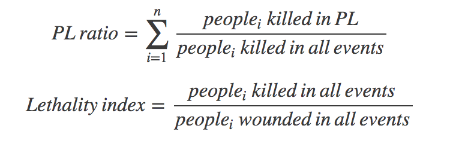
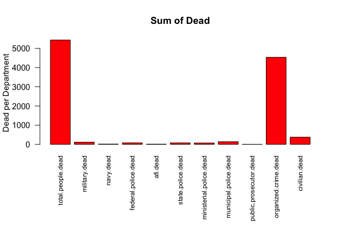
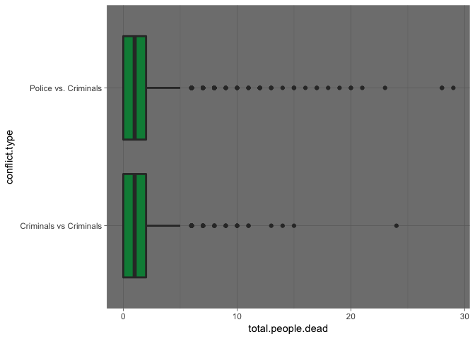

Data Challenge 1 --- Group 5
================

Question 1
----------

#### Can you replicate the 86.1% number?

The Drug Policy Program (PPD) at CIDE released a statement that included various calculations for the purpose of reporting crime statistics. We have yet to succeed in the replication of the 86.1% calculation. We found that it was difficult to come to that exact calculation because there are, we assume, so many levels of assumptions involved in modelling the data. Due to the fact that we did not know exactly how the original team came to these proportions (or which assumptions they made), we decided to delineate our own assumptions. We will further explain these assumptions, as well as our thought process, later in this paper.

Based on our assumptions and calculations (shown below) we arrived at a perfect lethality ratio of civilians of 51.9%, an overall lethality index of 1.34, a police lethality index of 3.46, a navy lethality Index of 7.14, and a army lethality index of 4.24.

#### Provide a visualization that presents this information neatly.



#### Please show the exact computations you used to calculate them (most likely than not, you'll need to do some additional munging in the data to get there).



where people\_i denotes the group of people of category i (FAF, civilians)

#### If you could not replicate them, please show why and the difference relative to your own computations (also, include a neat graph that summarizes this).

We found that it is difficult to get the same ratios as these researchers because there are so many layers of assumptions that need to be decided on to arrive at a calculation, and we do not have their model’s underlying assumptions. For example, they may have decided that only civilian deaths count towards the kill ratios, or civilians and members of organized crime. In addition, their definition of federal agencies may or may not include the army and navy.

#### Be very explicit: What are you assuming to generate these computations?

We assumed the following:

1.  The question specifies confrontations between federal armed forces and civilians. As such we separated the data into civilian versus civilian confrontations and civilians versus “federal armed forces”(FAF) confrontations. We then removed the civilian versus civilian confrontations as they do not provide information to answer the question. To isolate only civilian versus FAF confrontations we filtered for events in which detained, wounded, or killed in FAF departments was greater than zero.
2.  We also are assuming that “federal armed forces” (FAF) are composed of everyone other than civilians in the dataset. This includes military, navy, afi, federal police, municipal police, state police.
3.  We assumed that “civilian” includes both civilians and organized crime members.
4.  Also, we assume that perfect lethality ratio is the ratio of the deaths of civilians and organized crime in perfect lethality events (events where there are only dead and no wounded) over the total number of dead civilians and dead members of organized crime.
5.  We assume that the lethality index is the number of civilians killed over the number of civilians wounded by the FAF. We isolated specific FAF department lethality indexes by filtering for events in which there was at least one killed or wounded in that FAF department.
6.  We assume that FAF involved confrontation is comprised of events where federal police are killed, federal police are wounded, and/or there are multiple detained personnel.

Question 2
----------

#### Is this the right metric (perfect lethality) to look at? Why or why not?

Perfect lethality is defined as “dead civilians who presumably participated in confrontations with federal armed forces were killed in events of "perfect lethality" where there were only dead and no wounded. We do not think that the perfect lethality ratio is the right metric to look at because there are some gaps in the data provided. As such, the data does not necessarily match what is reported.

First, we do not have any data on “misses,” times in which federal armed forces fired at civilians but no one was killed or wounded. As a result we only have lethality information in specific instances in which people were hit. We do not have overall lethality ratios based on number of times shots were fired by armed forces. Second, we have no information on how many people were at events and how many people survived. Perfect lethality implies that everyone present dies at the event, but it is possible that 99% of civilians at each event survive and only one person dies. However, as it stands, we only have figures on dead and wounded. A better ratio could be calculated if we also had the information on unharmed survivors. Third, it is unclear from the data which civilians participated with which armed forces. As the data focuses on dead and wounded people, it is possible that the navy, military, and federal armed forces were all at an event but no armed forces were killed or wounded. It is also possible that civilians killed each other. From the way the data is presented, it is difficult to know which department killed or wounded who without making assumptions. Finally, current research does not specify if “civilian” includes or excludes organized crime. There could be significant differences between the lethality ratios of normal civilians and organized crime, but reporting as strictly “civilian” is misleading to the reader.

#### What is the "lethality index" showing explicitly? What is it not showing? What is the definition assuming?

Per the article, the lethality index is described as, “The lethality index of the Federal Police is 2.6 dead for every wounded, the Navy's reaches 17.3 dead for every wounded, and the Army's is 9.1 dead for every wounded.” The lethality index is explicitly showing the number of people each federal armed forces department kills for every person the department wounds.

It is not showing：

1.  Total and average number of wounded and dead individuals for all the confrontations.
2.  How the number of wounded and dead varied by the time, location, and type of confrontations.
3.  The ratio of people killed and wounded to the people that survived unharmed.
4.  If other federal forces departments were also present in the confrontations.
5.  If the ratio is different for confrontations with organized crime compared to civilians.

The definition of lethality index is assuming that:

1.  Number of wounded individuals is the most effective measure of number of dead individuals.
2.  Difference in the distributions of this index across different kind of confrontations can be ignored.
3.  Instances in which the federal forces fired but missed or solved the problem peacefully do not matter.
4.  No matter why the individuals died or got wounded, that is because of killing by police, criminals or other irrelevant reasons, it should be counted as the lethality index of the police force that participated.

#### With the same available data, can you think of an alternative way to capture the same construct? Is it "better"?

In order to make better sense of these data, narrowing the scope down by region might be helpful. By state, patterns of violence are more easily recognizable (for example: Tamaulipas, Nuevo León, Guerrero and Chihuahua have the highest positive instances of violence). Not capturing the variance of cases where this rate can be largely different according to case category, time and location.

Also, the formula of lethality index is not capturing the variance of the lethality ratio of each case. We hypothesize that the lethality ratio of each case can be largely different according to their features, such as the time during a day when the event happened, the date/season during a year when the event happened, or the location/region where the event happened. These are all important features that we want to specify if we are trying to evaluate a force’s lethality index. A better way to capture the variance is to calculate the lethality ratio by event, and to look at the distribution of these indexes against each feature of the events.

It would also be beneficial to refine and specify the ratios provided based on what is provided by the data. Currently the reporting on the data leads the reader to persume things that were not provided by the data. For example in relation to the perfect lethality ratio they should specify that is was calculated without knowing clear information on who participated, which department killed which category of person etc. But if one were to clearly define exactly what was included and what was not included, it would be a better way to capture the construct.

#### What additional information would you need to better understand the data?

To better understand these data as they were presented to us, we would have benefited from receiving the exact outline or code that original researchers used to come to their findings (proportions) and conclusions. Also it would have been helpful to understand the thought process behind assumptions the original team made when analyzing the data. We eventually were able to come to a model that we were comfortable with, but still were not successful in matching the original researchers’ numbers. In addition to the researcher’s methodology the following information would have been helpful for us to understand the data better:

1.  How many events occurred between forces and civilians in which there was no violence?

-   We would need this information to make accurate probabilistic inferences.

1.  Which locations were kept track of and for how long? Were some locations added later?

-   It is difficult to analyze the data over time if locations were added/dropped over time as this could change population size and number of events.

1.  Information on which forces were involved in each event.

-   We currently have to make assumptions on what forces were involved based on who was killed or wounded but we do not know if this is correct.

1.  Information on population size of each location and over time.

-   Differences in population size can impact the amount of confrontations.

1.  Information on how many people participated in each event and how many survived unharmed.
2.  Information on which exact force killed or wounded which category of person.
3.  A larger dataset which may include more cases of events on extreme cases, also provides a reasonably large sample on each small category.

-   It is difficult to make reliable conclusions on relationship between lethality index and features of events if observations by this feature are too few.

#### What additional information could help you better capture the construct behind the "lethality index"?

As aforementioned, we might have benefited from receiving information about how the researchers originally came to their claims. This could have helped us better capture the construct behind lethality index. An example of such information could be how the researchers chose what information to explicitly show by this index. As we discussed in the second question of question 2, the index is not showing the information to identify the confrontations, the overall number of casualties, etc.

Also, we listed the assumptions made based on the definition of lethality index. It would be beneficial if there was some information on how these assumptions were made, and why those assumptions were crucial to the lethality index.

Appendix
--------

#### Additional Visualizations



#### Codes

``` r
setwd("/Users/bobchen/Documents/Columbia/S17/5069 Applied Data Science/QMSS-GR5069/week_05/datachallenge1/data/processed")
fullData <- read.csv("ConfrontationsData_170209.csv")

library(dplyr)
library(ggplot2)

# Finding All Police vs. Criminals Events
Pol_vs_Crime <- filter(fullData, rowSums(fullData[,11:18]) > 0 |
                                 rowSums(fullData[,22:31]) > 0 | 
                                 detained > 0)
# Create Categorical Variable
fullData <- mutate(fullData, conflict.type = ifelse(rowSums(fullData[,11:18]) > 0 |
                                                    rowSums(fullData[,22:31]) > 0 |
                                                    detained > 0,
                                                    'Police vs. Criminals',
                                                    'Criminals vs Criminals'))

# Criminal vs. Criminal Confrontations
Crime_vs_Crime <- filter(fullData, rowSums(fullData[,11:18]) == 0,
                                   rowSums(fullData[,22:31]) == 0,
                                   detained == 0,
                                   rowSums(fullData[,c(19:20,30:31)]) > 0)

# Visualizations

dead.sums <- colSums(fullData[,10:20])

op <- par(mar = c(10,4,4,2) + 0.1)
barplot(dead.sums, ylab = "Dead per Department", main = "Sum of Dead", cex.names = 0.8,las=2, col = c("red"))
par(op)

wounded.sums <- colSums(fullData[,21:31])
op <- par(mar = c(10,4,4,2) + 0.1)
barplot(wounded.sums, ylab = "Wounded per Department", main = "Sum of Wounded", cex.names = 0.8,las=2, col = c("red"))
par(op)
ggplot(data = fullData, aes(conflict.type)) + 
       geom_bar(fill = "red4") + 
       theme(plot.title = element_text(size = 20, color = "blue4", hjust = 0.5),
                     panel.background = element_rect(fill = "lightsteelblue", 
                                        color = "blue4", size = 2),
                     axis.title  = element_text(color = "navyblue", size = 16, 
                                 face = "bold"),
                     axis.text  = element_text(color = "navyblue", size = 14)) +
       labs(y = "", x = "Type of Conflict")

#Boxplot shows compressed distribution
ggplot(data = fullData, aes(x = conflict.type, y = total.people.dead)) +
      geom_boxplot(fill = "springgreen4",size = 1) +
      theme(legend.position = "none") +
      theme_dark() +
      coord_flip()

#Filter out cases w/ more than 3 dead
sub <- filter(fullData, total.people.dead <= 3)

ggplot(data = sub, aes(x = conflict.type, y = total.people.dead)) +
      geom_boxplot(fill = "springgreen4",size = 1) +
      theme(legend.position = "none") +
      theme_dark() +
      coord_flip()

#Separating out by Agency--------------------------------------------------
Fed_Pol      <- filter(fullData, rowSums(fullData[,c(13,24)]) > 0)
Navy         <- filter(fullData, rowSums(fullData[,c(12,23)]) > 0)
Army         <- filter(fullData, rowSums(fullData[,c(11,22)]) > 0)
AFI          <- filter(fullData, rowSums(fullData[,c(14, 25)]) > 0)
State_Police <- filter(fullData, rowSums(fullData[,c(15, 26)]) > 0)
Ministerial  <- filter(fullData, rowSums(fullData[,c(16, 27)]) > 0)
Municipal    <- filter(fullData, rowSums(fullData[,c(17, 28)]) > 0)

# PL Ratios-----------------------------------------------------------------
PL.ratio <- data.frame()
PL.ratio[1:7, 1] <- c("Federal_Police",
                      "Navy",
                      "Army",
                      "AFI",
                      "State_Police",
                      "Ministerial_Police",
                      "Municipal_Police")

# PL Ratio of All Agencies
civ_killed_pl <- sum(filter(Pol_vs_Crime, civilian.wounded == 0,
                            organized.crime.wounded == 0)$civilian.dead)
oc_killed_pl  <- sum(filter(Pol_vs_Crime, civilian.wounded == 0,
                           organized.crime.wounded == 0)$organized.crime.dead)
civ_killed    <- sum(Pol_vs_Crime$civilian.dead)  
oc_killed     <- sum(Pol_vs_Crime$organized.crime.dead)

(oc_killed_pl + civ_killed_pl) / (civ_killed + oc_killed)

# PL Ratio of Federal Police
fedpol_pl <- sum(filter(Fed_Pol, civilian.wounded == 0 & 
                        organized.crime.wounded == 0)$civilian.dead) +
             sum(filter(Fed_Pol, civilian.wounded == 0 & 
                        organized.crime.wounded == 0)$organized.crime.dead)
fedpol_non_pl  <- sum(Fed_Pol$civilian.dead) + sum(Fed_Pol$organized.crime.dead)
PL.ratio[1, 2] <- (fedpol_pl / fedpol_non_pl) * 100

# PL Ratio of Navy
navy_pl <- sum(filter(Navy, civilian.wounded == 0 & 
                        organized.crime.wounded == 0)$civilian.dead) +
           sum(filter(Navy, civilian.wounded == 0 & 
                        organized.crime.wounded == 0)$organized.crime.dead)
navy_non_pl    <- sum(Navy$civilian.dead) + sum(Navy$organized.crime.dead)
PL.ratio[2, 2] <- (navy_pl / navy_non_pl) * 100

# PL Ratio of Army
army_pl <- sum(filter(Army, civilian.wounded == 0 & 
                        organized.crime.wounded == 0)$civilian.dead) +
           sum(filter(Army, civilian.wounded == 0 & 
                        organized.crime.wounded == 0)$organized.crime.dead)
army_non_pl    <- sum(Army$civilian.dead) + sum(Army$organized.crime.dead)
PL.ratio[3, 2] <- (army_pl / army_non_pl) * 100

# PL Ratio of AFI
afi_pl <- sum(filter(AFI, civilian.wounded == 0 & 
                        organized.crime.wounded == 0)$civilian.dead) +
             sum(filter(AFI, civilian.wounded == 0 & 
                        organized.crime.wounded == 0)$organized.crime.dead)
afi_non_pl     <- sum(AFI$civilian.dead) + sum(AFI$organized.crime.dead)
PL.ratio[4, 2] <- (afi_pl / afi_non_pl) * 100

# PL Ratio of State Police
stpol_pl <- sum(filter(State_Police, civilian.wounded == 0 & 
                        organized.crime.wounded == 0)$civilian.dead) +
            sum(filter(State_Police, civilian.wounded == 0 & 
                        organized.crime.wounded == 0)$organized.crime.dead)
stpol_non_pl   <- sum(State_Police$civilian.dead) +
                  sum(State_Police$organized.crime.dead)
PL.ratio[5, 2] <- (stpol_pl / stpol_non_pl) * 100
# PL Ratio of Ministerial Police
minpol_pl <- sum(filter(Ministerial, civilian.wounded == 0 & 
                        organized.crime.wounded == 0)$civilian.dead) +
             sum(filter(Ministerial, civilian.wounded == 0 & 
                        organized.crime.wounded == 0)$organized.crime.dead)
minpol_non_pl  <- sum(Ministerial$civilian.dead) +
                  sum(Ministerial$organized.crime.dead)
PL.ratio[6, 2] <- (minpol_pl / minpol_non_pl) * 100

# PL Ratio of Municipal Police
munpol_pl <- sum(filter(Municipal, civilian.wounded == 0 & 
                        organized.crime.wounded == 0)$civilian.dead) +
             sum(filter(Municipal, civilian.wounded == 0 & 
                        organized.crime.wounded == 0)$organized.crime.dead)
munpol_non_pl  <- sum(Municipal$civilian.dead) + 
                  sum(Municipal$organized.crime.dead)
PL.ratio[7, 2] <- (munpol_pl / munpol_non_pl) * 100

# Output
names(PL.ratio) <- c("Force_Type", "PL_Ratio")

#Agency Type

Agency.Type <- c("Federal", "Military", "Military", "Federal",
                 "State/Local","State/Local", "State/Local")

Pl.ratio <- cbind(PL.ratio, Agency.Type)

# Visualization for Lethality Index by Force Type
library(ggplot2)
library(ggthemes)
ggplot(PL.ratio, aes(x = reorder(Force_Type, PL_Ratio), 
                       y = PL_Ratio, fill = Agency.Type)) +
  geom_bar(stat = "identity") + 
  ggtitle("Percent of Kills in Events of Perfect Lethality") +
  theme(plot.title  = element_text(size = 20, color = "blue4", hjust = 0.5),
        axis.title  = element_text(color = "navyblue", size = 16, 
                                   face = "bold"),
        axis.text   = element_text(color = "navyblue", size = 14)) +
  labs(y = "Percent of Kills in Perfect Lethality", x = "Agency Type") +
  coord_flip() + 
  theme_economist() + 
  scale_fill_tableau()
  

kill.ratio <- data.frame()
kill.ratio[1:7, 1] <- c("Federal Police",
                        "Navy",
                        "Army",
                        "AFI",
                        "State Police",
                        "Ministerial Police",
                        "Municipal Police")
# Overall Lethality Index
OLI <- sum(Pol_vs_Crime[,c(19,20)]) / sum(Pol_vs_Crime[,c(30,31)])
OLI

# Federal Police Confrontations (3.46 dead for every wounded)

kill.ratio[1, 2] <- sum(Fed_Pol[,c(19,20)]) / sum(Fed_Pol[,c(30,31)]) 

# Navy Lethality Index (7.14)

kill.ratio[2, 2] <- sum(Navy[,c(19,20)]) / sum(Navy[,c(30,31)]) 

# Army Lethality Index (4.24)

kill.ratio[3, 2] <- sum(Army[,c(19,20)]) / sum(Army[,c(30,31)]) 

# AFI Lethality Index

kill.ratio[4, 2] <- sum(AFI[,c(19,20)]) / sum(AFI[,c(30,31)]) 

# State Police Lethality Index

kill.ratio[5, 2] <- sum(State_Police[,c(19,20)]) / sum(State_Police[,c(30,31)]) 

# Ministerial Police Lethality Index

kill.ratio[6, 2] <- sum(Ministerial[,c(19,20)]) / sum(Ministerial[,c(30,31)]) 

# Municipal Police Lethality Index

kill.ratio[7, 2] <- sum(Municipal[,c(19,20)]) / sum(Municipal[,c(30,31)]) 

#Add in Agency Types

kill.ratio <- cbind(kill.ratio, Agency.Type)

# Output
names(kill.ratio) <- c("Force_Type", "Lethality_Ratio", "Agency_Type")
kill.ratio$`Force_Type` <- as.factor(kill.ratio$`Force_Type`)

  
# Visualization for Lethality Index by Force Type
library(ggplot2)
ggplot(kill.ratio, aes(x = reorder(Force_Type, Lethality_Ratio),
                       y = Lethality_Ratio, fill= Agency_Type)) +
  geom_bar(stat = "identity") +
  theme_dark() +
  coord_flip() + 
  ggtitle("Lethality Index by Agency") +
  labs(y = "Lethality Index", x = "") + 
  theme(axis.title = element_text(size = 14, color = "grey41"),
        axis.text  = element_text(size = 10, color = "grey41"),
        plot.title = element_text(size = 15, color = "grey41", hjust = -.4)) + 
  theme_economist() + 
  scale_fill_tableau()
```
