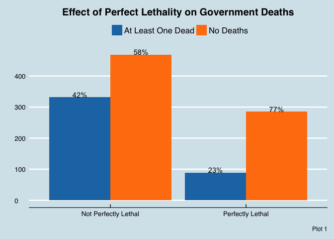
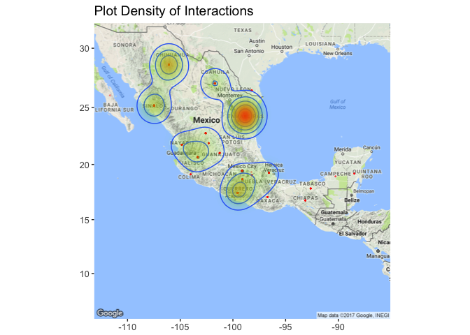

Data Challenge 2 --- Group 5
================

Question 1
==========

Part 1
------

Does the presence of perfect lethality by the government agencies in a conflict prevent government deaths?

To answer this question we performed a logistic regression with force.dead (if there were any deaths on the side of the government) as the dependent variable and perfect lethality (if the government forces executed with perfect lethality) as the independent variable. To control for seasonal variability and location, we controlled for month of the year and state as well. The results of the regression are as follows:

<table style="border-collapse:collapse; border:none;border-bottom:double;">
<td style="padding:0.2cm; border-top:double;">
 
</td>
<td style="border-bottom:1px solid; padding-left:0.5em; padding-right:0.5em; border-top:double;">
 
</td>
<td style="padding:0.2cm; text-align:center; border-bottom:1px solid; border-top:double;" colspan="4">
force.dead
</td>
</tr>
<tr>
<td style="padding:0.2cm; font-style:italic;">
 
</td>
<td style="padding-left:0.5em; padding-right:0.5em; font-style:italic;">
 
</td>
<td style="padding:0.2cm; text-align:center; font-style:italic; ">
B
</td>
<td style="padding:0.2cm; text-align:center; font-style:italic; ">
CI
</td>
<td style="padding:0.2cm; text-align:center; font-style:italic; ">
std. Error
</td>
<td style="padding:0.2cm; text-align:center; font-style:italic; ">
p
</td>
</tr>
<tr>
<td style="padding:0.2cm; border-top:1px solid; text-align:left;">
(Intercept)
</td>
<td style="padding-left:0.5em; padding-right:0.5em; border-top:1px solid; ">
 
</td>
<td style="padding:0.2cm; text-align:center; border-top:1px solid; ">
1.48
</td>
<td style="padding:0.2cm; text-align:center; border-top:1px solid; ">
-0.04 – 3.45
</td>
<td style="padding:0.2cm; text-align:center; border-top:1px solid; ">
0.85
</td>
<td style="padding:0.2cm; text-align:center; border-top:1px solid; ">
.081
</td>
</tr>
<tr>
<td style="padding:0.2cm; text-align:left;">
perfect.lethality
</td>
<td style="padding-left:0.5em; padding-right:0.5em;">
 
</td>
<td style="padding:0.2cm; text-align:center; ">
-0.86
</td>
<td style="padding:0.2cm; text-align:center; ">
-1.15 – -0.57
</td>
<td style="padding:0.2cm; text-align:center; ">
0.15
</td>
<td style="padding:0.2cm; text-align:center; ">
&lt;.001
</td>
</tr>
<tr>
<td style="padding:0.2cm;" colspan="6">
state
</td>
</tr>
<tr>
<td style="font-style:italic; padding:0.2cm; padding-left:0.6cm; text-align:left;">
stateBaja California
</td>
<td style="padding-left:0.5em; padding-right:0.5em;">
 
</td>
<td style="padding:0.2cm; text-align:center; ">
-1.83
</td>
<td style="padding:0.2cm; text-align:center; ">
-3.85 – -0.23
</td>
<td style="padding:0.2cm; text-align:center; ">
0.89
</td>
<td style="padding:0.2cm; text-align:center; ">
.038
</td>
</tr>
<tr>
<td style="font-style:italic; padding:0.2cm; padding-left:0.6cm; text-align:left;">
stateBaja California Sur
</td>
<td style="padding-left:0.5em; padding-right:0.5em;">
 
</td>
<td style="padding:0.2cm; text-align:center; ">
14.22
</td>
<td style="padding:0.2cm; text-align:center; ">
-281.29 – NA
</td>
<td style="padding:0.2cm; text-align:center; ">
1455.40
</td>
<td style="padding:0.2cm; text-align:center; ">
.992
</td>
</tr>
<tr>
<td style="font-style:italic; padding:0.2cm; padding-left:0.6cm; text-align:left;">
stateCampeche
</td>
<td style="padding-left:0.5em; padding-right:0.5em;">
 
</td>
<td style="padding:0.2cm; text-align:center; ">
-16.67
</td>
<td style="padding:0.2cm; text-align:center; ">
NA – 139.24
</td>
<td style="padding:0.2cm; text-align:center; ">
999.57
</td>
<td style="padding:0.2cm; text-align:center; ">
.987
</td>
</tr>
<tr>
<td style="font-style:italic; padding:0.2cm; padding-left:0.6cm; text-align:left;">
stateChiapas
</td>
<td style="padding-left:0.5em; padding-right:0.5em;">
 
</td>
<td style="padding:0.2cm; text-align:center; ">
-2.25
</td>
<td style="padding:0.2cm; text-align:center; ">
-4.49 – -0.37
</td>
<td style="padding:0.2cm; text-align:center; ">
1.02
</td>
<td style="padding:0.2cm; text-align:center; ">
.028
</td>
</tr>
<tr>
<td style="font-style:italic; padding:0.2cm; padding-left:0.6cm; text-align:left;">
stateChihuahua
</td>
<td style="padding-left:0.5em; padding-right:0.5em;">
 
</td>
<td style="padding:0.2cm; text-align:center; ">
-1.44
</td>
<td style="padding:0.2cm; text-align:center; ">
-3.39 – 0.07
</td>
<td style="padding:0.2cm; text-align:center; ">
0.84
</td>
<td style="padding:0.2cm; text-align:center; ">
.088
</td>
</tr>
<tr>
<td style="font-style:italic; padding:0.2cm; padding-left:0.6cm; text-align:left;">
stateCiudad de México
</td>
<td style="padding-left:0.5em; padding-right:0.5em;">
 
</td>
<td style="padding:0.2cm; text-align:center; ">
-1.79
</td>
<td style="padding:0.2cm; text-align:center; ">
-4.16 – 0.20
</td>
<td style="padding:0.2cm; text-align:center; ">
1.08
</td>
<td style="padding:0.2cm; text-align:center; ">
.097
</td>
</tr>
<tr>
<td style="font-style:italic; padding:0.2cm; padding-left:0.6cm; text-align:left;">
stateCoahuila de Zaragoza
</td>
<td style="padding-left:0.5em; padding-right:0.5em;">
 
</td>
<td style="padding:0.2cm; text-align:center; ">
-1.96
</td>
<td style="padding:0.2cm; text-align:center; ">
-3.95 – -0.39
</td>
<td style="padding:0.2cm; text-align:center; ">
0.87
</td>
<td style="padding:0.2cm; text-align:center; ">
.024
</td>
</tr>
<tr>
<td style="font-style:italic; padding:0.2cm; padding-left:0.6cm; text-align:left;">
stateColima
</td>
<td style="padding-left:0.5em; padding-right:0.5em;">
 
</td>
<td style="padding:0.2cm; text-align:center; ">
-17.03
</td>
<td style="padding:0.2cm; text-align:center; ">
NA – 48.48
</td>
<td style="padding:0.2cm; text-align:center; ">
640.93
</td>
<td style="padding:0.2cm; text-align:center; ">
.979
</td>
</tr>
<tr>
<td style="font-style:italic; padding:0.2cm; padding-left:0.6cm; text-align:left;">
stateDurango
</td>
<td style="padding-left:0.5em; padding-right:0.5em;">
 
</td>
<td style="padding:0.2cm; text-align:center; ">
-2.13
</td>
<td style="padding:0.2cm; text-align:center; ">
-4.11 – -0.58
</td>
<td style="padding:0.2cm; text-align:center; ">
0.86
</td>
<td style="padding:0.2cm; text-align:center; ">
.013
</td>
</tr>
<tr>
<td style="font-style:italic; padding:0.2cm; padding-left:0.6cm; text-align:left;">
stateGuanajuato
</td>
<td style="padding-left:0.5em; padding-right:0.5em;">
 
</td>
<td style="padding:0.2cm; text-align:center; ">
-1.46
</td>
<td style="padding:0.2cm; text-align:center; ">
-3.57 – 0.28
</td>
<td style="padding:0.2cm; text-align:center; ">
0.95
</td>
<td style="padding:0.2cm; text-align:center; ">
.124
</td>
</tr>
<tr>
<td style="font-style:italic; padding:0.2cm; padding-left:0.6cm; text-align:left;">
stateGuerrero
</td>
<td style="padding-left:0.5em; padding-right:0.5em;">
 
</td>
<td style="padding:0.2cm; text-align:center; ">
-1.05
</td>
<td style="padding:0.2cm; text-align:center; ">
-3.02 – 0.48
</td>
<td style="padding:0.2cm; text-align:center; ">
0.85
</td>
<td style="padding:0.2cm; text-align:center; ">
.218
</td>
</tr>
<tr>
<td style="font-style:italic; padding:0.2cm; padding-left:0.6cm; text-align:left;">
stateHidalgo
</td>
<td style="padding-left:0.5em; padding-right:0.5em;">
 
</td>
<td style="padding:0.2cm; text-align:center; ">
-1.51
</td>
<td style="padding:0.2cm; text-align:center; ">
-3.80 – 0.46
</td>
<td style="padding:0.2cm; text-align:center; ">
1.06
</td>
<td style="padding:0.2cm; text-align:center; ">
.153
</td>
</tr>
<tr>
<td style="font-style:italic; padding:0.2cm; padding-left:0.6cm; text-align:left;">
stateJalisco
</td>
<td style="padding-left:0.5em; padding-right:0.5em;">
 
</td>
<td style="padding:0.2cm; text-align:center; ">
-2.32
</td>
<td style="padding:0.2cm; text-align:center; ">
-4.34 – -0.72
</td>
<td style="padding:0.2cm; text-align:center; ">
0.89
</td>
<td style="padding:0.2cm; text-align:center; ">
.009
</td>
</tr>
<tr>
<td style="font-style:italic; padding:0.2cm; padding-left:0.6cm; text-align:left;">
stateMéxico
</td>
<td style="padding-left:0.5em; padding-right:0.5em;">
 
</td>
<td style="padding:0.2cm; text-align:center; ">
-1.84
</td>
<td style="padding:0.2cm; text-align:center; ">
-3.86 – -0.24
</td>
<td style="padding:0.2cm; text-align:center; ">
0.88
</td>
<td style="padding:0.2cm; text-align:center; ">
.037
</td>
</tr>
<tr>
<td style="font-style:italic; padding:0.2cm; padding-left:0.6cm; text-align:left;">
stateMichoacán de Ocampo
</td>
<td style="padding-left:0.5em; padding-right:0.5em;">
 
</td>
<td style="padding:0.2cm; text-align:center; ">
-1.31
</td>
<td style="padding:0.2cm; text-align:center; ">
-3.29 – 0.23
</td>
<td style="padding:0.2cm; text-align:center; ">
0.85
</td>
<td style="padding:0.2cm; text-align:center; ">
.124
</td>
</tr>
<tr>
<td style="font-style:italic; padding:0.2cm; padding-left:0.6cm; text-align:left;">
stateMorelos
</td>
<td style="padding-left:0.5em; padding-right:0.5em;">
 
</td>
<td style="padding:0.2cm; text-align:center; ">
-1.00
</td>
<td style="padding:0.2cm; text-align:center; ">
-3.09 – 0.73
</td>
<td style="padding:0.2cm; text-align:center; ">
0.94
</td>
<td style="padding:0.2cm; text-align:center; ">
.286
</td>
</tr>
<tr>
<td style="font-style:italic; padding:0.2cm; padding-left:0.6cm; text-align:left;">
stateNayarit
</td>
<td style="padding-left:0.5em; padding-right:0.5em;">
 
</td>
<td style="padding:0.2cm; text-align:center; ">
-2.33
</td>
<td style="padding:0.2cm; text-align:center; ">
-4.39 – -0.69
</td>
<td style="padding:0.2cm; text-align:center; ">
0.91
</td>
<td style="padding:0.2cm; text-align:center; ">
.010
</td>
</tr>
<tr>
<td style="font-style:italic; padding:0.2cm; padding-left:0.6cm; text-align:left;">
stateNuevo León
</td>
<td style="padding-left:0.5em; padding-right:0.5em;">
 
</td>
<td style="padding:0.2cm; text-align:center; ">
-1.94
</td>
<td style="padding:0.2cm; text-align:center; ">
-3.91 – -0.42
</td>
<td style="padding:0.2cm; text-align:center; ">
0.85
</td>
<td style="padding:0.2cm; text-align:center; ">
.022
</td>
</tr>
<tr>
<td style="font-style:italic; padding:0.2cm; padding-left:0.6cm; text-align:left;">
stateOaxaca
</td>
<td style="padding-left:0.5em; padding-right:0.5em;">
 
</td>
<td style="padding:0.2cm; text-align:center; ">
-1.95
</td>
<td style="padding:0.2cm; text-align:center; ">
-4.13 – -0.15
</td>
<td style="padding:0.2cm; text-align:center; ">
0.99
</td>
<td style="padding:0.2cm; text-align:center; ">
.047
</td>
</tr>
<tr>
<td style="font-style:italic; padding:0.2cm; padding-left:0.6cm; text-align:left;">
statePuebla
</td>
<td style="padding-left:0.5em; padding-right:0.5em;">
 
</td>
<td style="padding:0.2cm; text-align:center; ">
-0.39
</td>
<td style="padding:0.2cm; text-align:center; ">
-2.68 – 1.73
</td>
<td style="padding:0.2cm; text-align:center; ">
1.08
</td>
<td style="padding:0.2cm; text-align:center; ">
.720
</td>
</tr>
<tr>
<td style="font-style:italic; padding:0.2cm; padding-left:0.6cm; text-align:left;">
stateQuerétaro
</td>
<td style="padding-left:0.5em; padding-right:0.5em;">
 
</td>
<td style="padding:0.2cm; text-align:center; ">
13.91
</td>
<td style="padding:0.2cm; text-align:center; ">
-281.59 – NA
</td>
<td style="padding:0.2cm; text-align:center; ">
1455.40
</td>
<td style="padding:0.2cm; text-align:center; ">
.992
</td>
</tr>
<tr>
<td style="font-style:italic; padding:0.2cm; padding-left:0.6cm; text-align:left;">
stateQuintana Roo
</td>
<td style="padding-left:0.5em; padding-right:0.5em;">
 
</td>
<td style="padding:0.2cm; text-align:center; ">
-2.43
</td>
<td style="padding:0.2cm; text-align:center; ">
-5.79 – 0.09
</td>
<td style="padding:0.2cm; text-align:center; ">
1.41
</td>
<td style="padding:0.2cm; text-align:center; ">
.086
</td>
</tr>
<tr>
<td style="font-style:italic; padding:0.2cm; padding-left:0.6cm; text-align:left;">
stateSan Luis Potosí
</td>
<td style="padding-left:0.5em; padding-right:0.5em;">
 
</td>
<td style="padding:0.2cm; text-align:center; ">
-1.47
</td>
<td style="padding:0.2cm; text-align:center; ">
-3.58 – 0.26
</td>
<td style="padding:0.2cm; text-align:center; ">
0.94
</td>
<td style="padding:0.2cm; text-align:center; ">
.120
</td>
</tr>
<tr>
<td style="font-style:italic; padding:0.2cm; padding-left:0.6cm; text-align:left;">
stateSinaloa
</td>
<td style="padding-left:0.5em; padding-right:0.5em;">
 
</td>
<td style="padding:0.2cm; text-align:center; ">
-2.03
</td>
<td style="padding:0.2cm; text-align:center; ">
-4.00 – -0.50
</td>
<td style="padding:0.2cm; text-align:center; ">
0.85
</td>
<td style="padding:0.2cm; text-align:center; ">
.017
</td>
</tr>
<tr>
<td style="font-style:italic; padding:0.2cm; padding-left:0.6cm; text-align:left;">
stateSonora
</td>
<td style="padding-left:0.5em; padding-right:0.5em;">
 
</td>
<td style="padding:0.2cm; text-align:center; ">
-2.97
</td>
<td style="padding:0.2cm; text-align:center; ">
-5.07 – -1.28
</td>
<td style="padding:0.2cm; text-align:center; ">
0.93
</td>
<td style="padding:0.2cm; text-align:center; ">
.001
</td>
</tr>
<tr>
<td style="font-style:italic; padding:0.2cm; padding-left:0.6cm; text-align:left;">
stateTabasco
</td>
<td style="padding-left:0.5em; padding-right:0.5em;">
 
</td>
<td style="padding:0.2cm; text-align:center; ">
-2.43
</td>
<td style="padding:0.2cm; text-align:center; ">
-4.77 – -0.47
</td>
<td style="padding:0.2cm; text-align:center; ">
1.07
</td>
<td style="padding:0.2cm; text-align:center; ">
.023
</td>
</tr>
<tr>
<td style="font-style:italic; padding:0.2cm; padding-left:0.6cm; text-align:left;">
stateTamaulipas
</td>
<td style="padding-left:0.5em; padding-right:0.5em;">
 
</td>
<td style="padding:0.2cm; text-align:center; ">
-1.97
</td>
<td style="padding:0.2cm; text-align:center; ">
-3.92 – -0.47
</td>
<td style="padding:0.2cm; text-align:center; ">
0.84
</td>
<td style="padding:0.2cm; text-align:center; ">
.018
</td>
</tr>
<tr>
<td style="font-style:italic; padding:0.2cm; padding-left:0.6cm; text-align:left;">
stateTlaxcala
</td>
<td style="padding-left:0.5em; padding-right:0.5em;">
 
</td>
<td style="padding:0.2cm; text-align:center; ">
13.78
</td>
<td style="padding:0.2cm; text-align:center; ">
-281.75 – NA
</td>
<td style="padding:0.2cm; text-align:center; ">
1455.40
</td>
<td style="padding:0.2cm; text-align:center; ">
.992
</td>
</tr>
<tr>
<td style="font-style:italic; padding:0.2cm; padding-left:0.6cm; text-align:left;">
stateVeracruz de Ignacio de la Llave
</td>
<td style="padding-left:0.5em; padding-right:0.5em;">
 
</td>
<td style="padding:0.2cm; text-align:center; ">
-2.15
</td>
<td style="padding:0.2cm; text-align:center; ">
-4.20 – -0.52
</td>
<td style="padding:0.2cm; text-align:center; ">
0.90
</td>
<td style="padding:0.2cm; text-align:center; ">
.017
</td>
</tr>
<tr>
<td style="font-style:italic; padding:0.2cm; padding-left:0.6cm; text-align:left;">
stateZacatecas
</td>
<td style="padding-left:0.5em; padding-right:0.5em;">
 
</td>
<td style="padding:0.2cm; text-align:center; ">
-1.01
</td>
<td style="padding:0.2cm; text-align:center; ">
-3.08 – 0.69
</td>
<td style="padding:0.2cm; text-align:center; ">
0.93
</td>
<td style="padding:0.2cm; text-align:center; ">
.277
</td>
</tr>
<tr>
<td style="padding:0.2cm; text-align:left;">
MonthAbbAug
</td>
<td style="padding-left:0.5em; padding-right:0.5em;">
 
</td>
<td style="padding:0.2cm; text-align:center; ">
0.01
</td>
<td style="padding:0.2cm; text-align:center; ">
-0.58 – 0.61
</td>
<td style="padding:0.2cm; text-align:center; ">
0.30
</td>
<td style="padding:0.2cm; text-align:center; ">
.977
</td>
</tr>
<tr>
<td style="padding:0.2cm; text-align:left;">
MonthAbbDec
</td>
<td style="padding-left:0.5em; padding-right:0.5em;">
 
</td>
<td style="padding:0.2cm; text-align:center; ">
-0.07
</td>
<td style="padding:0.2cm; text-align:center; ">
-0.75 – 0.61
</td>
<td style="padding:0.2cm; text-align:center; ">
0.35
</td>
<td style="padding:0.2cm; text-align:center; ">
.845
</td>
</tr>
<tr>
<td style="padding:0.2cm; text-align:left;">
MonthAbbFeb
</td>
<td style="padding-left:0.5em; padding-right:0.5em;">
 
</td>
<td style="padding:0.2cm; text-align:center; ">
0.03
</td>
<td style="padding:0.2cm; text-align:center; ">
-0.59 – 0.66
</td>
<td style="padding:0.2cm; text-align:center; ">
0.32
</td>
<td style="padding:0.2cm; text-align:center; ">
.919
</td>
</tr>
<tr>
<td style="padding:0.2cm; text-align:left;">
MonthAbbJan
</td>
<td style="padding-left:0.5em; padding-right:0.5em;">
 
</td>
<td style="padding:0.2cm; text-align:center; ">
-0.22
</td>
<td style="padding:0.2cm; text-align:center; ">
-0.91 – 0.46
</td>
<td style="padding:0.2cm; text-align:center; ">
0.35
</td>
<td style="padding:0.2cm; text-align:center; ">
.529
</td>
</tr>
<tr>
<td style="padding:0.2cm; text-align:left;">
MonthAbbJul
</td>
<td style="padding-left:0.5em; padding-right:0.5em;">
 
</td>
<td style="padding:0.2cm; text-align:center; ">
-0.33
</td>
<td style="padding:0.2cm; text-align:center; ">
-0.97 – 0.30
</td>
<td style="padding:0.2cm; text-align:center; ">
0.32
</td>
<td style="padding:0.2cm; text-align:center; ">
.302
</td>
</tr>
<tr>
<td style="padding:0.2cm; text-align:left;">
MonthAbbJun
</td>
<td style="padding-left:0.5em; padding-right:0.5em;">
 
</td>
<td style="padding:0.2cm; text-align:center; ">
0.17
</td>
<td style="padding:0.2cm; text-align:center; ">
-0.46 – 0.81
</td>
<td style="padding:0.2cm; text-align:center; ">
0.32
</td>
<td style="padding:0.2cm; text-align:center; ">
.595
</td>
</tr>
<tr>
<td style="padding:0.2cm; text-align:left;">
MonthAbbMar
</td>
<td style="padding-left:0.5em; padding-right:0.5em;">
 
</td>
<td style="padding:0.2cm; text-align:center; ">
-0.43
</td>
<td style="padding:0.2cm; text-align:center; ">
-1.06 – 0.21
</td>
<td style="padding:0.2cm; text-align:center; ">
0.32
</td>
<td style="padding:0.2cm; text-align:center; ">
.187
</td>
</tr>
<tr>
<td style="padding:0.2cm; text-align:left;">
MonthAbbMay
</td>
<td style="padding-left:0.5em; padding-right:0.5em;">
 
</td>
<td style="padding:0.2cm; text-align:center; ">
0.15
</td>
<td style="padding:0.2cm; text-align:center; ">
-0.48 – 0.78
</td>
<td style="padding:0.2cm; text-align:center; ">
0.32
</td>
<td style="padding:0.2cm; text-align:center; ">
.651
</td>
</tr>
<tr>
<td style="padding:0.2cm; text-align:left;">
MonthAbbNov
</td>
<td style="padding-left:0.5em; padding-right:0.5em;">
 
</td>
<td style="padding:0.2cm; text-align:center; ">
0.15
</td>
<td style="padding:0.2cm; text-align:center; ">
-0.50 – 0.79
</td>
<td style="padding:0.2cm; text-align:center; ">
0.33
</td>
<td style="padding:0.2cm; text-align:center; ">
.658
</td>
</tr>
<tr>
<td style="padding:0.2cm; text-align:left;">
MonthAbbOct
</td>
<td style="padding-left:0.5em; padding-right:0.5em;">
 
</td>
<td style="padding:0.2cm; text-align:center; ">
-0.14
</td>
<td style="padding:0.2cm; text-align:center; ">
-0.74 – 0.47
</td>
<td style="padding:0.2cm; text-align:center; ">
0.31
</td>
<td style="padding:0.2cm; text-align:center; ">
.662
</td>
</tr>
<tr>
<td style="padding:0.2cm; text-align:left;">
MonthAbbSep
</td>
<td style="padding-left:0.5em; padding-right:0.5em;">
 
</td>
<td style="padding:0.2cm; text-align:center; ">
0.30
</td>
<td style="padding:0.2cm; text-align:center; ">
-0.35 – 0.95
</td>
<td style="padding:0.2cm; text-align:center; ">
0.33
</td>
<td style="padding:0.2cm; text-align:center; ">
.364
</td>
</tr>
<tr>
<td style="padding:0.2cm; padding-top:0.1cm; padding-bottom:0.1cm; text-align:left; border-top:1px solid;">
Observations
</td>
<td style="padding-left:0.5em; padding-right:0.5em; border-top:1px solid;">
 
</td>
<td style="padding:0.2cm; padding-top:0.1cm; padding-bottom:0.1cm; text-align:center; border-top:1px solid;" colspan="4">
1174
</td>
</tr>
<tr>
<td style="padding:0.2cm; text-align:left; padding-top:0.1cm; padding-bottom:0.1cm;">
R<sup>2</sup> / adj. R<sup>2</sup>
</td>
<td style="padding-left:0.5em; padding-right:0.5em;">
 
</td>
<td style="padding:0.2cm; text-align:center; padding-top:0.1cm; padding-bottom:0.1cm;" colspan="4">
.093 / .128
</td>
</tr>
</table>
    ## [1] 0.4246105

These results indicate that if the government operates with perfect lethality, they reduce the odds of the government incurring a death in an event with conflict by 42% controlling for location and time of year, the effect is statistically significant at the p&lt;.001 level.

This analysis indicates a very significant drop in conflict events with government deaths if the government executes with perfect lethality. Plot 1 indicates that the government incurs a casualty in a much smaller portion of the events where perfect lethality is used. This is a very important relationship to examine and we would highly recommend further study; if perfect lethality prevents government deaths it would partially explain its frequency in these conflicts (the government agencies would have a lot of incentive to act more lethally if it prevents deaths on their side). At the same time, these government run organizations have a civic duty to reduce the number of people killed in raids. This creates an interesting dynamic between two opposing forces; the government agencies that conduct these raids and the government oversight organizations responsible for good governance. The former would probably support using more lethal force if it prevents deaths of their own people, the latter would probably push the agencies to reduce their lethality to prevent human rights abuses. There are limitations to this analysis; the sample is bias towards events with no deaths. This is hard to overcome as the events just occur in this distribution. Overall, this analysis gives valuable insight into a difficult subject and suggests that further study would be beneficial.



Part 2
------

Question 2: Does violence or being detained act as a function of distance from the border to the U.S.? Is the more activity closer to the border?

The necessary transformation was to create a new variable that represents border closeness.

According to the *mexicocity3* plot, there seems to be a high density of activity close to the border (as aforementioned and hypothesized).



The limitations of this analysis are that it is not exact, because "closest states to the border" was allocated to certain states according to a ggmap plot of points --rather than with a precise calculation (which can be created through the *raster* package or another distance-measuring package). Also, by designating the binary variable *borderclose* to only encapsulate 4 states we might be limiting ourselves in size.

    ## 
    ## Call:
    ## glm(formula = state1$borderclose ~ state1$detained + state1$total.people.dead + 
    ##     state1$total.people.wounded, family = binomial(link = "logit"), 
    ##     data = state1)
    ## 
    ## Deviance Residuals: 
    ##     Min       1Q   Median       3Q      Max  
    ## -0.3488  -0.3269  -0.3143  -0.2927   2.7374  
    ## 
    ## Coefficients:
    ##                              Estimate Std. Error z value Pr(>|z|)    
    ## (Intercept)                 -2.775836   0.274318 -10.119   <2e-16 ***
    ## state1$detained              0.009528   0.047710   0.200    0.842    
    ## state1$total.people.dead    -0.070826   0.081426  -0.870    0.384    
    ## state1$total.people.wounded -0.042335   0.080621  -0.525    0.600    
    ## ---
    ## Signif. codes:  0 '***' 0.001 '**' 0.01 '*' 0.05 '.' 0.1 ' ' 1
    ## 
    ## (Dispersion parameter for binomial family taken to be 1)
    ## 
    ##     Null deviance: 348.25  on 928  degrees of freedom
    ## Residual deviance: 346.62  on 925  degrees of freedom
    ## AIC: 354.62
    ## 
    ## Number of Fisher Scoring iterations: 6

We thought that perhaps violence or imprisonment might be a function of U.S. border closeness. According to the multiple logistic regression of variables on predictor variable border-closeness, *detained* was statistically significant (p &lt; 0.008). The negative coefficient for this variable suggests that all other variables equal, those who are detained are less likely to be close to the U.S./Mexico border. For every one unit change in *detained*, the log odds of being near the border decreases by 0.101. This could be because when you are near the border, your interactions with the police are more likely to be violence (thus, leading to death rather than being detained). Also, the null devience (which shows how well the response variable is predicted by a model that includes only the intercept) is different than the residual deviance by a 10.1 point decrease and loss of only 3 degrees of freedom.

The results are fairly consistent with what we believed our findings would be, although we also suspected that perhaps increased violence might be a function of border closeness. You are less likely to be close to the border when you are detained. The theory about how the data might act as a function of distance from the U.S. border is an interesting one, and perhaps there will be more evidence to support this theory somewhere within the data after addressing the limitations.

Question 2
==========

Hypothesis 1
------------

Our first hypothesis is that there will be more total overall deaths if army was involved in the confrontation, regardless of the scale of the combat.

#### Assumptions

The assumption is that a confrontation was of a larger scale if there were more vehicles and long guns seized in that event. This is based on 4 sub-assumptions:

1.  More vehicles and long guns seized means more vehicles and long guns were used in the confrontation
2.  More participating forces if more vehicles were used
3.  More vehicles also added complexitiy to the combat, such as explosion and defense
4.  More long guns means participants could be murdered within a longer distance

#### Computations

The marginal effect referenced was the "B" column provided by the regression model and is interpreted as described in the marginal effect section below. The "B" value represents the slope of the regression line for the variable of interest. To arrive at standard error and confidence intervals by running OLS, the results are reflected in "std.Error" and "CI" columns, respectively, the CIs are 95% confidence interval. The 95% confidence intervals represent +/- two standard errors from the mean "B" marginal effect value. Computation methods for hypothesis 1 and 2 are the same.

#### Findings

Below is an exhibition of our findings. The result demonstrates that there are more deaths if army was involved in the confrontation, regardless of the scale of the combat, which agrees with our hypothesis.

The marginal effect of the involvement of army on deaths is 0.16(95% confidence interval range of .03 to .28), on average, ceteris paribus. This effect is statistically significant at a 95% confidence level. The marginal effects of `vehicles.seized` and `long.guns.seized` are both positive and significant as well. The interactions show that if the army is involved each additional vehicle seized has a marginal effect of at 0.00 (95% confidence interval of -0.01 – 0.02) on average total overall deaths, certis paribus. It also shows that if the army is involved each additional long gun seized has a marginal effect of at -0.12 (95% confidence interval of -0.01 – 0.02) on average total overall deaths, certis paribus. The interaction does show that army involvement will decreases the marginal effect of long guns seized at -0.12 (95% confidence interval of -0.15 – -0.09) .

<table style="border-collapse:collapse; border:none;border-bottom:double;">
<td style="padding:0.2cm; border-top:double;">
 
</td>
<td style="border-bottom:1px solid; padding-left:0.5em; padding-right:0.5em; border-top:double;">
 
</td>
<td style="padding:0.2cm; text-align:center; border-bottom:1px solid; border-top:double;" colspan="4">
total.people.dead
</td>
</tr>
<tr>
<td style="padding:0.2cm; font-style:italic;">
 
</td>
<td style="padding-left:0.5em; padding-right:0.5em; font-style:italic;">
 
</td>
<td style="padding:0.2cm; text-align:center; font-style:italic; ">
B
</td>
<td style="padding:0.2cm; text-align:center; font-style:italic; ">
CI
</td>
<td style="padding:0.2cm; text-align:center; font-style:italic; ">
std. Error
</td>
<td style="padding:0.2cm; text-align:center; font-style:italic; ">
p
</td>
</tr>
<tr>
<td style="padding:0.2cm; border-top:1px solid; text-align:left;">
(Intercept)
</td>
<td style="padding-left:0.5em; padding-right:0.5em; border-top:1px solid; ">
 
</td>
<td style="padding:0.2cm; text-align:center; border-top:1px solid; ">
2.06
</td>
<td style="padding:0.2cm; text-align:center; border-top:1px solid; ">
1.84 – 2.27
</td>
<td style="padding:0.2cm; text-align:center; border-top:1px solid; ">
0.11
</td>
<td style="padding:0.2cm; text-align:center; border-top:1px solid; ">
&lt;.001
</td>
</tr>
<tr>
<td style="padding:0.2cm; text-align:left;">
army
</td>
<td style="padding-left:0.5em; padding-right:0.5em;">
 
</td>
<td style="padding:0.2cm; text-align:center; ">
-0.29
</td>
<td style="padding:0.2cm; text-align:center; ">
-0.73 – 0.15
</td>
<td style="padding:0.2cm; text-align:center; ">
0.22
</td>
<td style="padding:0.2cm; text-align:center; ">
.191
</td>
</tr>
<tr>
<td style="padding:0.2cm; text-align:left;">
vehicles.seized
</td>
<td style="padding-left:0.5em; padding-right:0.5em;">
 
</td>
<td style="padding:0.2cm; text-align:center; ">
0.11
</td>
<td style="padding:0.2cm; text-align:center; ">
0.02 – 0.20
</td>
<td style="padding:0.2cm; text-align:center; ">
0.05
</td>
<td style="padding:0.2cm; text-align:center; ">
.021
</td>
</tr>
<tr>
<td style="padding:0.2cm; text-align:left;">
long.guns.seized
</td>
<td style="padding-left:0.5em; padding-right:0.5em;">
 
</td>
<td style="padding:0.2cm; text-align:center; ">
0.21
</td>
<td style="padding:0.2cm; text-align:center; ">
0.16 – 0.27
</td>
<td style="padding:0.2cm; text-align:center; ">
0.03
</td>
<td style="padding:0.2cm; text-align:center; ">
&lt;.001
</td>
</tr>
<tr>
<td style="padding:0.2cm; text-align:left;">
army:vehicles.seized
</td>
<td style="padding-left:0.5em; padding-right:0.5em;">
 
</td>
<td style="padding:0.2cm; text-align:center; ">
0.31
</td>
<td style="padding:0.2cm; text-align:center; ">
0.14 – 0.48
</td>
<td style="padding:0.2cm; text-align:center; ">
0.09
</td>
<td style="padding:0.2cm; text-align:center; ">
&lt;.001
</td>
</tr>
<tr>
<td style="padding:0.2cm; text-align:left;">
army:long.guns.seized
</td>
<td style="padding-left:0.5em; padding-right:0.5em;">
 
</td>
<td style="padding:0.2cm; text-align:center; ">
-0.16
</td>
<td style="padding:0.2cm; text-align:center; ">
-0.23 – -0.09
</td>
<td style="padding:0.2cm; text-align:center; ">
0.04
</td>
<td style="padding:0.2cm; text-align:center; ">
&lt;.001
</td>
</tr>
<tr>
<td style="padding:0.2cm; padding-top:0.1cm; padding-bottom:0.1cm; text-align:left; border-top:1px solid;">
Observations
</td>
<td style="padding-left:0.5em; padding-right:0.5em; border-top:1px solid;">
 
</td>
<td style="padding:0.2cm; padding-top:0.1cm; padding-bottom:0.1cm; text-align:center; border-top:1px solid;" colspan="4">
1175
</td>
</tr>
<tr>
<td style="padding:0.2cm; text-align:left; padding-top:0.1cm; padding-bottom:0.1cm;">
R<sup>2</sup> / adj. R<sup>2</sup>
</td>
<td style="padding-left:0.5em; padding-right:0.5em;">
 
</td>
<td style="padding:0.2cm; text-align:center; padding-top:0.1cm; padding-bottom:0.1cm;" colspan="4">
.133 / .129
</td>
</tr>
</table>
#### Limitations

The limitations of our interference are:

1.  the marginal effects of vehicles and long guns seized might not linear(addictive), but our model fails to detect if this is true
2.  the marginal effect of army could be so overwhelming large that our result might not differ a lot from the one that evaluate the marginal effects of army with no interactions at all
3.  there might be multicollinearity because armys use vehicles and long guns a lot

Hypothesis 2
------------

Our conditional hypothesis is that the total number of people dead is conditional upon the interaction between which federal force was involved and how many people were detained. We predict that if the army/navy/federal police is involved in an event each additional person detained results in a lower number of total people dead on average. The rationale behind this prediction is that if there an event with federal forces that ends with more detained people, it is likely to be less deadly.

#### Assumptions

1.  If there are events in which federal forces detained more people, it is less likely to be deadly.
2.  Federal forces include the army, navy, and federal police.
3.  Total overall deaths is the dependent parameter of interest.

#### Variables

`navy`, `army`, and `federal police` are binary variables in which 1 = they were involved in an event and 0 = they were not involved in an event. `total.people.dead` and `detained` are numeric variables in that increase by one from 0 up each representing an additonal person dead or detained. Additionally in order to preform the analysis we assumed that in each event only the army, navy, or federal police were present alone at each event.

Below is the multi-variate regression model with interactions to test this hypothesis:

<table style="border-collapse:collapse; border:none;border-bottom:double;">
<td style="padding:0.2cm; border-top:double;">
 
</td>
<td style="border-bottom:1px solid; padding-left:0.5em; padding-right:0.5em; border-top:double;">
 
</td>
<td style="padding:0.2cm; text-align:center; border-bottom:1px solid; border-top:double;" colspan="4">
total.people.dead
</td>
</tr>
<tr>
<td style="padding:0.2cm; font-style:italic;">
 
</td>
<td style="padding-left:0.5em; padding-right:0.5em; font-style:italic;">
 
</td>
<td style="padding:0.2cm; text-align:center; font-style:italic; ">
B
</td>
<td style="padding:0.2cm; text-align:center; font-style:italic; ">
CI
</td>
<td style="padding:0.2cm; text-align:center; font-style:italic; ">
std. Error
</td>
<td style="padding:0.2cm; text-align:center; font-style:italic; ">
p
</td>
</tr>
<tr>
<td style="padding:0.2cm; border-top:1px solid; text-align:left;">
(Intercept)
</td>
<td style="padding-left:0.5em; padding-right:0.5em; border-top:1px solid; ">
 
</td>
<td style="padding:0.2cm; text-align:center; border-top:1px solid; ">
2.21
</td>
<td style="padding:0.2cm; text-align:center; border-top:1px solid; ">
1.97 – 2.45
</td>
<td style="padding:0.2cm; text-align:center; border-top:1px solid; ">
0.12
</td>
<td style="padding:0.2cm; text-align:center; border-top:1px solid; ">
&lt;.001
</td>
</tr>
<tr>
<td style="padding:0.2cm; text-align:left;">
navy
</td>
<td style="padding-left:0.5em; padding-right:0.5em;">
 
</td>
<td style="padding:0.2cm; text-align:center; ">
1.18
</td>
<td style="padding:0.2cm; text-align:center; ">
-0.09 – 2.44
</td>
<td style="padding:0.2cm; text-align:center; ">
0.64
</td>
<td style="padding:0.2cm; text-align:center; ">
.069
</td>
</tr>
<tr>
<td style="padding:0.2cm; text-align:left;">
army
</td>
<td style="padding-left:0.5em; padding-right:0.5em;">
 
</td>
<td style="padding:0.2cm; text-align:center; ">
0.70
</td>
<td style="padding:0.2cm; text-align:center; ">
0.26 – 1.14
</td>
<td style="padding:0.2cm; text-align:center; ">
0.22
</td>
<td style="padding:0.2cm; text-align:center; ">
.002
</td>
</tr>
<tr>
<td style="padding:0.2cm; text-align:left;">
federal.police
</td>
<td style="padding-left:0.5em; padding-right:0.5em;">
 
</td>
<td style="padding:0.2cm; text-align:center; ">
0.17
</td>
<td style="padding:0.2cm; text-align:center; ">
-0.46 – 0.79
</td>
<td style="padding:0.2cm; text-align:center; ">
0.32
</td>
<td style="padding:0.2cm; text-align:center; ">
.604
</td>
</tr>
<tr>
<td style="padding:0.2cm; text-align:left;">
detained
</td>
<td style="padding-left:0.5em; padding-right:0.5em;">
 
</td>
<td style="padding:0.2cm; text-align:center; ">
0.12
</td>
<td style="padding:0.2cm; text-align:center; ">
0.02 – 0.22
</td>
<td style="padding:0.2cm; text-align:center; ">
0.05
</td>
<td style="padding:0.2cm; text-align:center; ">
.022
</td>
</tr>
<tr>
<td style="padding:0.2cm; text-align:left;">
navy:detained
</td>
<td style="padding-left:0.5em; padding-right:0.5em;">
 
</td>
<td style="padding:0.2cm; text-align:center; ">
0.16
</td>
<td style="padding:0.2cm; text-align:center; ">
-0.06 – 0.37
</td>
<td style="padding:0.2cm; text-align:center; ">
0.11
</td>
<td style="padding:0.2cm; text-align:center; ">
.159
</td>
</tr>
<tr>
<td style="padding:0.2cm; text-align:left;">
army:detained
</td>
<td style="padding-left:0.5em; padding-right:0.5em;">
 
</td>
<td style="padding:0.2cm; text-align:center; ">
-0.20
</td>
<td style="padding:0.2cm; text-align:center; ">
-0.33 – -0.07
</td>
<td style="padding:0.2cm; text-align:center; ">
0.07
</td>
<td style="padding:0.2cm; text-align:center; ">
.003
</td>
</tr>
<tr>
<td style="padding:0.2cm; text-align:left;">
federal.police:detained
</td>
<td style="padding-left:0.5em; padding-right:0.5em;">
 
</td>
<td style="padding:0.2cm; text-align:center; ">
-0.00
</td>
<td style="padding:0.2cm; text-align:center; ">
-0.13 – 0.13
</td>
<td style="padding:0.2cm; text-align:center; ">
0.07
</td>
<td style="padding:0.2cm; text-align:center; ">
.996
</td>
</tr>
<tr>
<td style="padding:0.2cm; padding-top:0.1cm; padding-bottom:0.1cm; text-align:left; border-top:1px solid;">
Observations
</td>
<td style="padding-left:0.5em; padding-right:0.5em; border-top:1px solid;">
 
</td>
<td style="padding:0.2cm; padding-top:0.1cm; padding-bottom:0.1cm; text-align:center; border-top:1px solid;" colspan="4">
1175
</td>
</tr>
<tr>
<td style="padding:0.2cm; text-align:left; padding-top:0.1cm; padding-bottom:0.1cm;">
R<sup>2</sup> / adj. R<sup>2</sup>
</td>
<td style="padding-left:0.5em; padding-right:0.5em;">
 
</td>
<td style="padding:0.2cm; text-align:center; padding-top:0.1cm; padding-bottom:0.1cm;" colspan="4">
.030 / .024
</td>
</tr>
</table>
#### Marginal Effects

**Intercept** The intercept in the regression output above shows that if no navy, army, or federal police were involved an if no one was detained, the average number of total people dead is 1.03.

**Coeffiencts** Given this is a conditional interaction, the model shows that if the navy is involved and no one is detained on average .43 (95% confidence interval range of .07 to .81) more people killed overall, holding all other variables constant with statistical signifiance (p-value of at least .05). If the army is involved and no one is detained on average .37 (95% confidence interval range of .24 to .51) more people killed overall, holding all other variables constant with statistical signifiance (p-value of at least .05). If the federal police is involved and no one is detained on average -.25 (95% confidence interval range of -.45 to -.04) less people killed overall, holding all other variables constant with statistical signifiance (p-value of at least .05). Additionally for each additional detained person when no one from the navy, army, or federal police is involved on average .04 (95% confidence interval range of .00 to .08) more people killed overall, holding all other variables constant with statistical signifiance (p-value of at least .05).

**Interactions** The interation terms show that if the navy is involved, each additional detained person recorded in the event results in on average .17 (95% confidence interval of .08 to .26) more people killed overall , holding all other variables constant with statistical signifiance (p-value of at least .05). If the army is involved, each additional detained person recorded in the event results in on average -.09 (95% confidence interval of -.14 to -.04) less people killed overall , holding all other variables constant with statistical signifiance (p-value of at least .05). Finally if the federal police are involved each additional detained person recorded in the event results in on average .06 (95% confidence interval of .00 to .12) more people killed overall, holding all other variables constant with statistical signifiance (p-value of at least .05).

**Conclusion** The hypothesis stated proved to be partial true per the data. In the case of the navy and federal police, each indivial detained person recorded actual resulted in an increase in average overall deaths which is contrary to the prediction. In the case of the army, each individual detained person recorded resulted in a decrease in average overall deaths.

#### Limitations

The data is limited as the data is only provides information for a few year period of time in certain locations in mexico. The regression focuses on total people dead and did not segregate the analysis by which type of person died in each event.As such more detailed analysis would have to be preformed to get more insight on what type of person dies as more people are detained by certain armed forces. Additionally it is possible that the army, navy, and federal police were all at certain events which would complicate the analysis of the data as they are interrelated.

Codes
=====

``` r
# Question 1 Part 1
library(dplyr)
data <- read.csv("/Users/bobchen/Documents/Columbia/S17/5069 Applied Data Science/QMSS-GR5069/week_07/datachallenge2/data/processed/AllViolenceData_170216.csv")

#Create variable for total deaths for all government agencies
data <- mutate(data, total.force.dead = state.police.dead + municipal.police.dead  + 
                                        federal.police.dead + afi.dead + navy.dead +
                                        ministerial.police.dead + military.dead    +
                                        public.prosecutor.dead)

#Remove cases with no deaths and wounded. This separates out events with no conflict. 

data <- filter(data, total.people.dead > 0, total.people.wounded > 0)

#Create month variables to control for seasonal variability
library(lubridate)
data$force.dead <- ifelse(data$total.force.dead > 0, 1, 0)
data$date <- as.Date(data$date)
data$month <- month(data$date)
data <- mutate(data, MonthAbb = month.abb[month])

#Logistic regression model
log <- glm(force.dead ~ perfect.lethality + state + MonthAbb , data = data, family = "binomial")
library(sjPlot)
sjt.lm(log, show.se = TRUE)
coef <- as.data.frame(coefficients(log))
exp(coef[2,1])

library(ggplot2)
library(dplyr)
library(ggthemes)

data$dead <- ifelse(data$total.force.dead > 0, 1, 0)

data$perf.leth <- ifelse(data$perfect.lethality == 0, "Not Perfectly Lethal", 
                          "Perfectly Lethal")
data$dead <- ifelse(data$force.dead == 0, "No Deaths", "At Least One Dead")

bardata <- data %>% 
  group_by(dead, perf.leth) %>%
  summarise(count = n())

bardata$percentage <- c("42%", "23%", "58%", "77%")

ggplot(bardata, aes(x = perf.leth, 
                    y = count,
                    fill = dead)) + 
  geom_bar(stat = "identity", position = "dodge") +
  geom_text(aes(label = percentage), vjust = 0.2, color = "black", position=position_dodge(.9)) +
  ggtitle("Effect of Perfect Lethality on Government Deaths") +
  theme_economist() + scale_fill_tableau() +
  labs(x = "", y = "", caption = "Plot 1") + 
  theme(plot.title = element_text(hjust = .5),
        legend.title = element_blank())

# Question 1 Part 2
library(ggmap)
library(raster)
library(ggplot2)
state <- c("Aguascalientes", "Baja California", "Baja California Sur", "Campeche", "Coahuila de Zaragoza", "Colima", "Chiapas", "Chihuahua", "Ciudad de México", "Durango", "Guanajuato", "Guerrero", "Hidalgo", "Jalisco", "Mexico", "Michoacan de Ocampo", "Morelos", "Nayarit", "Nuevo Leon", "Oaxaca", "Puebla", "Queretaro", "Quintana Roo", "San Luis Potosi", "Sinaloa", "Sonora", "Tabasco", "Tamaulipas", "Tlaxcala", "Veracruz de Ignacio de la Llave", "Yucatan", "Zacatecas")
geo.state <- geocode(state)
state.x <- geo.state$lon
state.y <- geo.state$lat
df1 <- data.frame(state.x, state.y)
DF1 <- cbind(state, df1)
state1 <- merge(DF1, data, by = c("state"))
mexicomap1 <- get_map(location= 'mexico city', zoom = 3, maptype = "terrain", source = 'google')
mexicocity1 <- ggmap(mexicomap1) + geom_point(aes(x = state.x, y = state.y), data = state1, size = 0.3, alpha = 0.3, color = "red") 
mexicomap2 <- get_map(location= 'mexico city', zoom = 5, maptype = "terrain", source = 'google')
mexicocity2 <- ggmap(mexicomap2) + geom_point(aes(x = state.x, y = state.y), data = state1, size = 0.3, alpha = 0.3, color = "red") 
mexicocity3 <- mexicocity2 + geom_density2d(data = state1, aes(x = state.x, y = state.y)) +
stat_density2d(data = state1, aes(x = state.x, y = state.y,  fill =..level.., alpha =..level..),
size = 0.01, bins = 25, geom = 'polygon') +
scale_fill_gradient(low = "green", high = "red") +
scale_alpha(range = c(0.00, 0.25), guide = FALSE) +
theme(legend.position = "none", axis.title = element_blank(), text = element_text(size = 12)) +
ggtitle("Plot Density of Interactions")
mexicocity3

closetoborder <- c("Nuevo Leon", "Chihuahua", "Coahuila de Zaragoza", "Ciudad de Mexico") #these are the states closest to the U.S. border
farfromborder <- c("Aguascalientes", "Baja California", "Baja California Sur", "Campeche", "Colima", "Chiapas", "Durango", "Guanajuato", "Guerrero", "Hidalgo", "Jalisco", "México", "Michoacán de Ocampo", "Morelos", "Nayarit", "Oaxaca", "Puebla", "Querétaro", "Quintana Roo", "San Luis Potosí", "Sinaloa", "Sonora", "Tabasco", "Tamaulipas", "Tlaxcala", "Veracruz de Ignacio de la Llave", "Yucatán", "Zacatecas")

state1$borderclose <- ifelse(state1$state == c("Nuevo Leon", "Chihuahua", "Coahuila de Zaragoza", "Ciudad de Mexico"), 1, 0)
bordermodel <- glm(state1$borderclose ~ state1$detained + state1$total.people.dead + state1$total.people.wounded, family = binomial(link = "logit"), data = state1)
summary(bordermodel)

# Question 2
lm1 <- lm(total.people.dead ~ army + vehicles.seized * army + long.guns.seized * army, data = data)
sjt.lm(lm1, show.se = TRUE)

lm2 <- lm(total.people.dead ~ navy + army + federal.police + detained + detained * navy + detained * army + detained * federal.police, data = data)
sjt.lm(lm2, show.se = TRUE)
```
