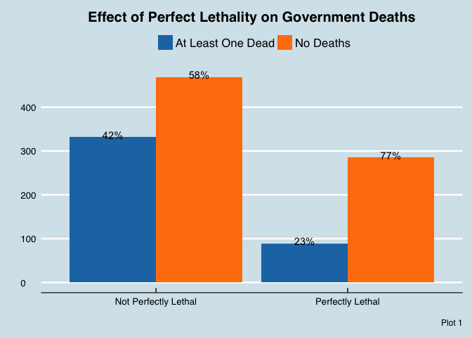

Data Challenge 2
================
Sam Gass
3/21/2017

Question 1 Part 1
=================

Does the presence of perfect lethality by the government agencies in a conflict prevent government deaths?

``` r
#Data Transformations
library(dplyr)
data <- read.csv("AllViolenceData_170216.csv")

#Create variable for total deaths for all government agencies
data <- mutate(data, total.force.dead = state.police.dead + municipal.police.dead  + 
                                        federal.police.dead + afi.dead + navy.dead +
                                        ministerial.police.dead + military.dead    +
                                        public.prosecutor.dead)

#Create month variables to control for seasonal variability
library(lubridate)
data$force.dead <- ifelse(data$total.force.dead > 0, 1, 0)
data$date <- as.Date(data$date)
data$month <- month(data$date)
data <- mutate(data, MonthAbb = month.abb[month])
```

To answer this question we performed a logistic regression with force.dead (if there were any deaths on the side of the government) as the dependent variable and perfect lethality (if the government forces executed with perfect lethality) as the independent variable. To control for seasonal variability and location, we controlled for month of the year and state as well. The results of the regression are as follows:

``` r
#Logistic regression model
log <- glm(force.dead ~ perfect.lethality + state + MonthAbb , data = data, family = "binomial")
summary(log)
```

    ## 
    ## Call:
    ## glm(formula = force.dead ~ perfect.lethality + state + MonthAbb, 
    ##     family = "binomial", data = data)
    ## 
    ## Deviance Residuals: 
    ##     Min       1Q   Median       3Q      Max  
    ## -1.2504  -0.5948  -0.4717  -0.3511   2.5783  
    ## 
    ## Coefficients:
    ##                                        Estimate Std. Error z value
    ## (Intercept)                            0.082996   0.410456   0.202
    ## perfect.lethality                     -0.657128   0.105875  -6.207
    ## stateBaja California                  -1.246285   0.442893  -2.814
    ## stateBaja California Sur              -1.193323   0.894561  -1.334
    ## stateCampeche                         -1.637585   1.155276  -1.417
    ## stateChiapas                          -2.059050   0.611472  -3.367
    ## stateChihuahua                        -1.073227   0.400877  -2.677
    ## stateCiudad de México                 -0.524570   0.602917  -0.870
    ## stateCoahuila de Zaragoza             -1.892551   0.427528  -4.427
    ## stateColima                           -2.463765   0.830368  -2.967
    ## stateDurango                          -1.735312   0.422885  -4.104
    ## stateGuanajuato                       -1.730722   0.496454  -3.486
    ## stateGuerrero                         -1.307990   0.406413  -3.218
    ## stateHidalgo                          -1.207480   0.603878  -2.000
    ## stateJalisco                          -1.669701   0.436481  -3.825
    ## stateMéxico                           -0.969788   0.438829  -2.210
    ## stateMichoacán de Ocampo              -1.547105   0.414496  -3.732
    ## stateMorelos                          -1.320861   0.482734  -2.736
    ## stateNayarit                          -1.953669   0.492008  -3.971
    ## stateNuevo León                       -2.208718   0.407591  -5.419
    ## stateOaxaca                           -1.378828   0.522184  -2.641
    ## statePuebla                           -0.682288   0.546404  -1.249
    ## stateQuerétaro                        -0.093596   1.075447  -0.087
    ## stateQuintana Roo                     -2.588283   0.829568  -3.120
    ## stateSan Luis Potosí                  -1.344495   0.487359  -2.759
    ## stateSinaloa                          -1.332439   0.409694  -3.252
    ## stateSonora                           -1.896258   0.459691  -4.125
    ## stateTabasco                          -2.160262   0.654124  -3.303
    ## stateTamaulipas                       -2.376549   0.403864  -5.885
    ## stateTlaxcala                         -1.829490   1.148292  -1.593
    ## stateVeracruz de Ignacio de la Llave  -1.897276   0.449694  -4.219
    ## stateYucatán                         -11.735989 196.968092  -0.060
    ## stateZacatecas                        -1.543926   0.463255  -3.333
    ## MonthAbbAug                           -0.201929   0.194206  -1.040
    ## MonthAbbDec                            0.078566   0.215734   0.364
    ## MonthAbbFeb                            0.027113   0.196962   0.138
    ## MonthAbbJan                           -0.122047   0.214256  -0.570
    ## MonthAbbJul                           -0.336392   0.194924  -1.726
    ## MonthAbbJun                            0.005096   0.195357   0.026
    ## MonthAbbMar                           -0.430062   0.202742  -2.121
    ## MonthAbbMay                           -0.008738   0.195432  -0.045
    ## MonthAbbNov                            0.169443   0.191323   0.886
    ## MonthAbbOct                           -0.072182   0.186694  -0.387
    ## MonthAbbSep                            0.086940   0.197407   0.440
    ##                                      Pr(>|z|)    
    ## (Intercept)                          0.839758    
    ## perfect.lethality                    5.41e-10 ***
    ## stateBaja California                 0.004893 ** 
    ## stateBaja California Sur             0.182212    
    ## stateCampeche                        0.156341    
    ## stateChiapas                         0.000759 ***
    ## stateChihuahua                       0.007424 ** 
    ## stateCiudad de México                0.384271    
    ## stateCoahuila de Zaragoza            9.57e-06 ***
    ## stateColima                          0.003006 ** 
    ## stateDurango                         4.07e-05 ***
    ## stateGuanajuato                      0.000490 ***
    ## stateGuerrero                        0.001289 ** 
    ## stateHidalgo                         0.045550 *  
    ## stateJalisco                         0.000131 ***
    ## stateMéxico                          0.027109 *  
    ## stateMichoacán de Ocampo             0.000190 ***
    ## stateMorelos                         0.006215 ** 
    ## stateNayarit                         7.16e-05 ***
    ## stateNuevo León                      5.99e-08 ***
    ## stateOaxaca                          0.008278 ** 
    ## statePuebla                          0.211779    
    ## stateQuerétaro                       0.930648    
    ## stateQuintana Roo                    0.001808 ** 
    ## stateSan Luis Potosí                 0.005803 ** 
    ## stateSinaloa                         0.001145 ** 
    ## stateSonora                          3.71e-05 ***
    ## stateTabasco                         0.000958 ***
    ## stateTamaulipas                      3.99e-09 ***
    ## stateTlaxcala                        0.111109    
    ## stateVeracruz de Ignacio de la Llave 2.45e-05 ***
    ## stateYucatán                         0.952488    
    ## stateZacatecas                       0.000860 ***
    ## MonthAbbAug                          0.298448    
    ## MonthAbbDec                          0.715724    
    ## MonthAbbFeb                          0.890514    
    ## MonthAbbJan                          0.568928    
    ## MonthAbbJul                          0.084391 .  
    ## MonthAbbJun                          0.979188    
    ## MonthAbbMar                          0.033903 *  
    ## MonthAbbMay                          0.964338    
    ## MonthAbbNov                          0.375812    
    ## MonthAbbOct                          0.699031    
    ## MonthAbbSep                          0.659640    
    ## ---
    ## Signif. codes:  0 '***' 0.001 '**' 0.01 '*' 0.05 '.' 0.1 ' ' 1
    ## 
    ## (Dispersion parameter for binomial family taken to be 1)
    ## 
    ##     Null deviance: 4382.7  on 5393  degrees of freedom
    ## Residual deviance: 4148.3  on 5350  degrees of freedom
    ##   (2 observations deleted due to missingness)
    ## AIC: 4236.3
    ## 
    ## Number of Fisher Scoring iterations: 10

``` r
coef <- as.data.frame(coefficients(log))
exp(coef[2,1])
```

    ## [1] 0.518338

These results indicate that if the government operates with perfect lethality, they reduce the odds of the government incurring a death in that conflict by 48% controlling for location and time of year.

This analysis indicates a very significant drop in events with government deaths if the government executes with perfect lethality. This is a very important relationship to examine and I would highly recommend further study; if perfect lethality prevents government deaths it would explain its frequency in the conflicts (the government agencies would have a lot of incentive to act more lethally if it prevented deaths). At the same time, as government run agencies these organizations should try to reduce the number of people killed in raids. This observation creates an interesting dynamic between two opposing forces; the government agencies that conduct these raids and the government oversight organizations responsible for good governance. The former would probably support using more lethal force if it prevents deaths of their own people, the latter would probably push the agencies to reduce their lethality to prevent human rights abuses. There are limitations to this analysis; because there are so many incidents with no deaths, the sample is fairly bias and the results are probably not entirely reliable. This is hard to overcome as the events just occur in this distribution. Overall, this analysis gives valuable insight into a difficult subject. If the government wants to reduce deaths it will probably need to present an alternative to government forces.

``` r
library(ggplot2)
data$dead <- ifelse(data$total.force.dead > 0, 1, 0)

bardata <- data %>% 
  group_by(dead, perfect.lethality) %>%
  summarise(count = n())

bardata$percentage <- c("72%", "28%", "77%", "23%")
bardata$perfect.lethality <- as.factor(bardata$perfect.lethality)
bardata$dead <- as.factor(bardata$dead)

ggplot(bardata, aes(x = dead, 
                    y = count,
                    fill = perfect.lethality)) + 
  geom_bar(stat = "identity", position = "dodge") +
  geom_text(aes(label = percentage), vjust = 0.2, color = "black", position=position_dodge(.9)) +
  ggtitle("Perfect Lethality Proportion in Death and No-death Confrontations") +
  theme_minimal()
```

 In visualizing this drop brought by perfect lethality in police force death, we made a barplot showing different lethality proportion of cases with police death and no police death. We can see that perfect lethality accounts for a larger percent of the cases where there was no death in police forces. To be specific, in non-death cases 28% are perfectly lethal, while in cases involving police death, only 23% cases are perfect lethal. This is in consistence with the result found in regression analysis.
